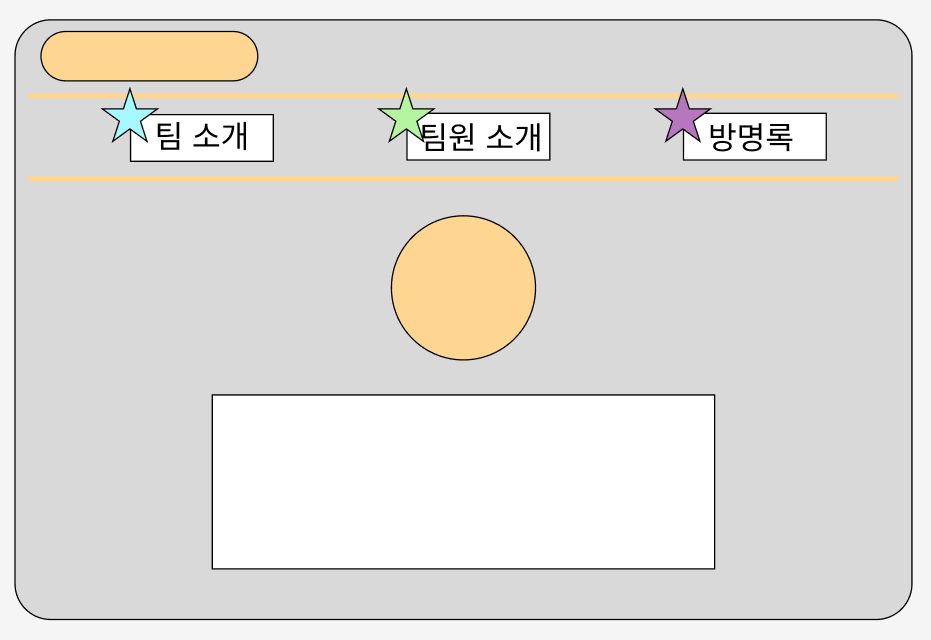
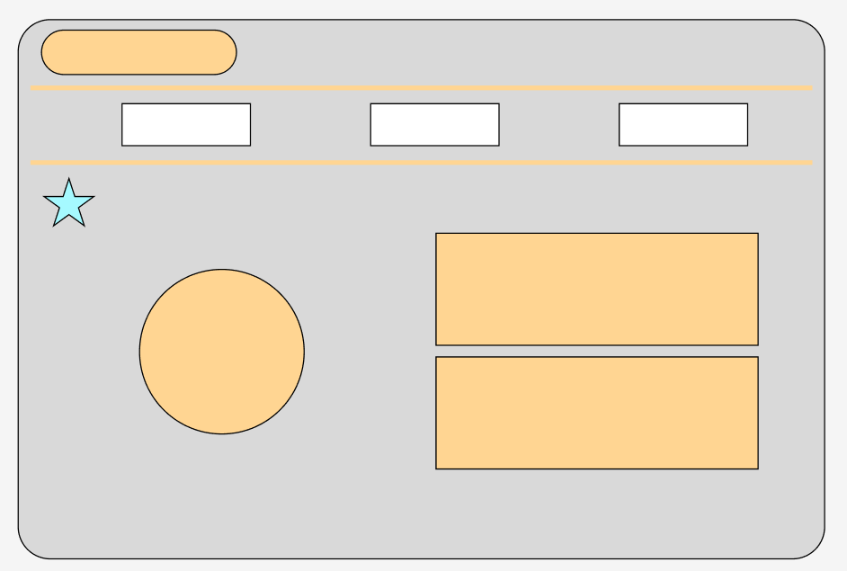
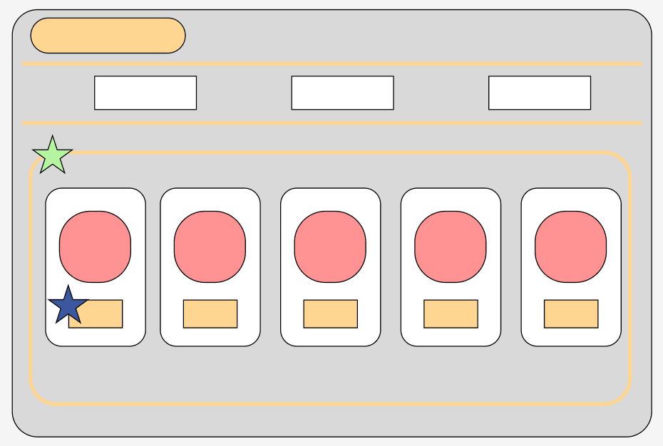
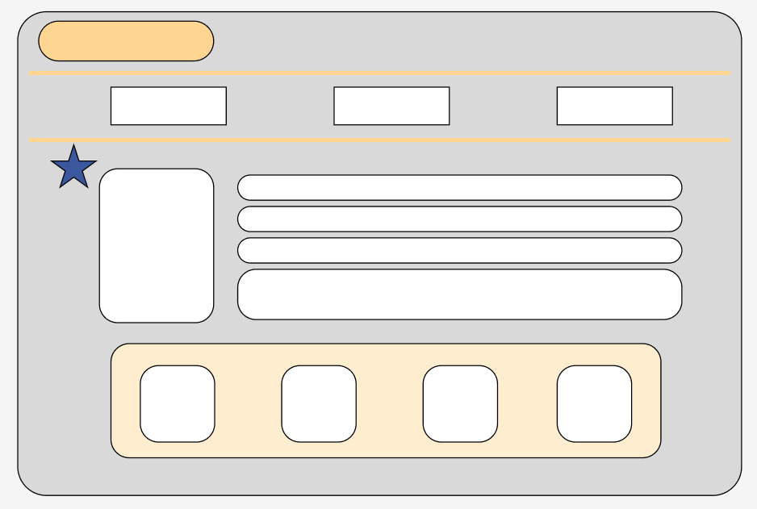
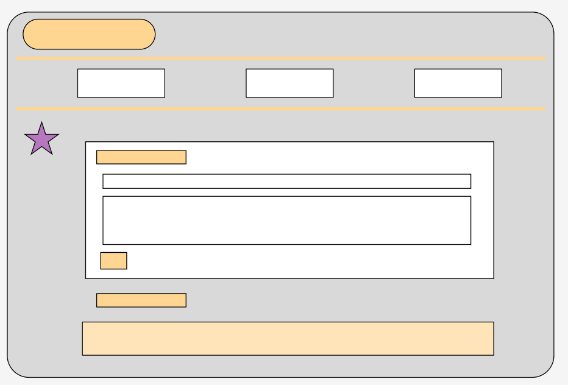

# 🐣 팀 소개 프로젝트 "Five-Function" 🐥

Five-Function은 내일배움캠프 Spring/Kotlin track 7기 7조에서 진행한 **팀 소개 웹페이지 만들기** 프로젝트입니다.

🐥 **개발 기간** : 2025.04.07 ~ 2025.04.11 <br>
⚙️ **개발 환경** : HTML, CSS, JavaScript, Firebase, JQuery, Bootstrap, Git, GitHub

## 목차

1. [⚙️ 시작 가이드](#⚙️-시작-가이드)
2. [📁 와이어 프레임 및 페이지 설명](#📁-와이어-프레임-및-페이지-설명)
3. [각 페이지별 기능 설명](#각-페이지별-기능-설명)
   1. [메인 페이지](#1-메인-페이지)
   2. [팀 소개 페이지](#2-팀-소개-페이지)
   3. [팀원 소개 페이지](#3-팀원-소개-페이지)
   4. [개인 상세 페이지](#4-개인-상세-페이지)
   5. [방명록 페이지](#5-방명록-페이지)
4. [❓ 트러블 슈팅](#❓-트러블-슈팅)
   1. [⭐ 구대웅님](#⭐-구대웅님)
   2. [⭐ 박민철님](#⭐-박민철님)
   3. [⭐ 차순영님](#⭐-차순영님)
   4. [⭐ 이예진님](#⭐-이예진님)
   5. [⭐ 천세경님](#⭐-천세경님)

<br>
<br>

### 👨‍👨‍👦 팀원 소개

| 구대웅                                       | 천세경                                       | 이예진                                   | 박민철                                       | 차순영                                             |
| -------------------------------------------- | -------------------------------------------- | ---------------------------------------- | -------------------------------------------- | -------------------------------------------------- |
| **팀장**                                     | 팀원                                         | 팀원                                     | 팀원                                         | 팀원                                               |
| [@GuDaeWoong](https://github.com/GuDaeWoong) | [@GyeongSe99](https://github.com/GyeongSe99) | [@YeJin420](https://github.com/YeJin420) | [@syuare-dev](https://github.com/syuare-dev) | [@ChaCha89-code](https://github.com/ChaCha89-code) |
| 메인 페이지                                  | 방명록 페이지                                | 개인 상세 페이지                         | 팀 소개 페이지                               | 팀원 소개 페이지                                   |

<br>
<br>

## ⚙️ 시작 가이드

### Config

아래 코드를 이용하여 레포지토리 클론 후 Config 적용

```
$ git clone https://github.com/GuDaeWoong/Five-Function.git
```

<br>

**guestbook.html** 파일의 `<script type="module">` 태그 아래 자신의 Firebase 연동 정보를 입력 후 실행

```
const firebaseConfig = {
	/**
	* Firebase 설정 정보
	*/
};
```

<br>

## 📁 와이어 프레임 및 페이지 설명

| 메인 페이지                                             |
| ------------------------------------------------------- |
|  |

| 팀 소개 페이지                                                    |
| ----------------------------------------------------------------- |
|  |

| 팀원 소개 페이지                                                      |
| --------------------------------------------------------------------- |
|  |

| 개인 상세 페이지                                                          |
| ------------------------------------------------------------------------- |
|  |

| 방명록 페이지                                                     |
| ----------------------------------------------------------------- |
|  |

<br>
<br>

## 각 페이지별 기능 설명

### 1. 메인 페이지

처음 프로그램을 실행할 경우 보여지는 **메인페이지** 입니다.

- **header** : 헤더의 로고 부분에 `<a>`태그를 사용하여 홈페이지의 메인으로 이동하는 하이퍼링크를 연결하였습니다.
- **navigation bar** : `<nav>`태그와 `<li>`태그를 이용하여 각 요소에 맞는 페이지의 하이퍼링크를 연결하였습니다.
- **main image** : 이미지의 **사이즈가 너무 커질 경우 시선이 분산되는 것을 방지**하기 위해 **width, height에 max값을 설정**하여 반응형으로 구현하되, 사용자 친화적으로 구현하였습니다.

### 2. 팀 소개 페이지

팀에 대한 정보를 조회할 수 있는 페이지입니다.

- 팀 소개 페이지는 **팀 이미지를 적절하게 조정한 .team-photo 클래스**와, **팀 설명을 담은 .team-description 클래스**, 그리고 이 **두 클래스를 하나로 묶은 .team-info 클래스**로 구성하였습니다.
- CSS를 통해 팀 설명 박스에 그림자 요소를 추가하여 조금 더 고급스러운 디자인으로 구현하였습니다.
- Bootstrap의 그리드 container를 사용하여 팀 이미지와 팀 설명 박스가 균형 있게 배치되도록 구현하였습니다.
- **Flexbox 기능을 활용**하여 다양한 화면 크기에 대응하는 **반응형 레이아웃**으로 구현하였습니다.
  - .team-info 와 .container는 flex-wrap 속성을 사용해 **화면 크기에 따라 자동으로 요소들이 줄 바꿈되도록 설계**하였습니다.

### 3. 팀원 소개 페이지

팀원 카드를 통해 각 팀원의 개인 상세 페이지로 이동할 수 있는 페이지입니다.

- 개인 상세 페이지로 연결될 수 있도록 상세보기 버튼에 `<a>` 태그를 추가하였습니다.
- BootStrap의 카드 그룹과 버튼 양식을 사용하여 구현하였습니다.
- 각 카드는 BootStrap을 사용하되, **사용자 설정 CSS 스타일 형식을 통해 디자인을 커스텀** 하였습니다.
- 프로필 사진의 **비율을 보존**하기 위해 CSS 스타일에 **object-fit**을 사용하였습니다.

### 4. 개인 상세 페이지

팀원들의 정보를 조회할 수 있는 페이지입니다.

- **photo box** : 사진 박스 단일이 아닌 **테두리에 border**를 넣어 **액자형식으로 작성**하였습니다.
- **info box** : `<a>` 태그를 사용하여 팀원들의 Blog/Github 하이퍼링크 연결하였습니다.
- **bio box** : 각 팀원들마다 사진크기와 자기소개글 비율이 달라 **각각 사이즈를 고정하여 자연스럽게 보이도록 수정**하였습니다.
- **team member section** : 팀원들의 한마디 박스와 각 대화 내용의 박스 안쪽으로 배경색, 테두리, 그림자 등을 설정하였습니다.
- 각 박스마다 사이즈를 설정하고 max-width 을 넣어 사용자의 시선이 중앙에 집중될 수 있도록 하였습니다.

### 5. 방명록 페이지

방명록을 작성하고 조회할 수 있는 페이지입니다.

- Firebase와 연동하여 **작성자의 이름, 방명록 내용, 작성일자를 저장하고 조회**할 수 있습니다.
- guestbook.html파일의 Firebase Config부분에 **Firebase 연동에 필요한 설정을 하지 않으면** "데이터 불러오기를 실패하였습니다.(Firebase 연동 실패)" 라는 문구가 노출됩니다.
- Firebase와 연동한 후 **Firebase collection에 document가 존재하지 않을 경우,** "작성된 방명록이 없습니다." 라는 문구가 노출됩니다.
- 방명록 저장 시 javascript의 new Date()함수를 사용하여 작성된 시간을 함께 저장하고, **최신순으로 조회**할 수 있도록 정렬하였습니다.
- 입력창을 누를 경우 사용자가 어떤 입력창에 작성중인지 알기 편하게 하기위해 **테두리를 강조**하였습니다.

<br>
<br>

## ❓ 트러블 슈팅

### ⭐ 구대웅님

**문제1**
| | |
|---|---|
| **문제** | 방명록을 작성하면 Firebase에 데이터가 저장되고, 작성된 방명록이 아래쪽에 추가되는 기능을 구현하려 했으나, jQuery에 대한 미숙함으로 인해 어려움을 겪었습니다. |
| **시도** | 기존 샘플 데이터를 참고하여 활성화 방법을 알아봄 |
| **해결방안** | jQuery를 찾아보고 사용하여 폼 제출 이벤트를 처리했으며 사용자가 방명록을 작성하면, jQuery를 통해 입력된 데이터를 가져오도록 구현했습니다. |

**문제2**
| | |
|---|---|
| **문제** | 한페이지로 구성하여 상단 네비게이션 바를 이용해서 원하는 곳으로 이동하는 것 |
| **시도** | 다양한 코드를 보고 수정 해 보려고 시도함 |
| **해결방안** | 아직은 어려우므로 페이지 분할하여 링크식으로 변환 |

<br>

### ⭐ 박민철님

**문제1.** 화면 크기에 따른 반응형 콘텐츠로 작업 필요
| | |
|---|---|
| **문제** | **1)** 화면(페이지) 크기가 변하더라도 배치된 이미지나 텍스트 등이 자동 조정되지 않고 그대로 잘리는 문제 <br> **2)** 특히 좌측에 이미지, 우측에 텍스트 내용이 배치되어 있어, 가로 형태로 배치되어있기에 화면 크기가 작아지면 좌측의 이미지만 보이게 됨 |
| **시도** | **1)** 화면 크기 조정에 따라 조정해주는 명령어나 쿼리에 대해 고민 <br> **2)** 화면 크기가 일정 수치만큼 줄어들 경우 콘텐츠가 자동으로 줄바꿈 되도록 작업 시도 |
| **해결방안** | - **max-width 사용**: %로 사용 시 크기가 너무 커지는 것을 확인, 고정 px값을 제공하여 이미지가 너무 커지지 않도록 설정 <br> - **object-fit: contain**: 이미지 비율이 유지되도록 사용 <br> - **flex-wrap: wrap**: <br> > 여러 콘텐츠의 가로 배치된 내용의 경우 화면 크기가 작아지면 우측의 내용이 보이지 않게 되거나 보기 힘들게 되어 있음 <br> > 화면 크기가 줄어들 수록 콘텐츠가 자동 줄바꿈이 되도록 설정 |

**문제2.** 이미지 / 텍스트 콘텐츠가 따로 동작하는 문제

|              |                                                                                                                                     |
| ------------ | ----------------------------------------------------------------------------------------------------------------------------------- |
| **문제**     | 반응형 콘텐츠로 작업된 내용들의 경우 화면 크기에 맞춰 자동적으로 조정이 되나, 이미지 공간 따로, 텍스트 공간 따로 작동하는 것을 확인 |
| **시도**     | 이미지와 텍스트 공간을 하나의 그룹으로 묶어줄 필요가 있어 해당 작업 시도                                                            |
| **해결방안** | 부트스트랩 - containers 사용 <br> 코드는 사진으로 대체                                                                              |

**문제3.** github push/pull 충돌
| | |
|---|---|
| **문제** | git clone 이후 기존 작업 페이지에서 코드 수정 후 업로드가 필요한 상황에서, git pull 이후 git push 시도하였으니 정상적으로 작동하지 않았던 문제 - github > main 브랜치에서 git pull을 성공했다고 표시되나, git push 시도 시 여전히 git pull을 시도하라는 에러 메시지 확인 - git log를 확인해본 결과 main 브랜치에 적용된 최신 log가 확인되지 않음 <br> 사진1, 사진2 |
| **시도** | 1. 여러 차례 git pull / git push 진행 <br> 2. git pull 이후 git add, commit 재실행 후 git push 시도 <br> 3. git pull origin 브런치 --allow-unrelated-histories 를 통해 원격 저장소(github)와 로컬 저장소(내 PC)의 히스토리 확인, 히스토리가 일치하지 않은 파일 삭제 후 git pull 재시도 |
| **문제 해결** | 위의 시도를 모두 진행해보았으나 모두 해결되지 않아, 가장 확실한 방법인 작업 폴더, 파일을 모두 삭제 후 처음부터 다시 시작, 해결됨 <br> - git clone > git pull > git add/commit > git push|
| **문제 원인** | 작업 폴더에 git clone을 하기 전에 git init을 한 것이 원인, 로컬 저장소의 .git의 추척 내용과, 원격 저장소의 .git 추적 내용이 달라서 발생한 문제였던 것으로 확인 |

<br>

### ⭐ 차순영님

**문제1**
| | |
|---|---|
| **문제** | Github 사용 어려움 (pull 했으나 push 가 안되고 push 하라고 할 경우) |
| **해결방안** | vscode의 source control 파트에서 changes확인 후 조정 |

**문제2**
| | |
|---|---|
| **문제** | CSS를 활용해 팀원 소개 파트 위치 조정, 팀원 프로필 사진 비율 조정 |
| **해결방안** | object fit을 활용해 프로필 사진 비율 보존 |

**문제3**
| | |
|---|---|
| **문제** | ‘align-items : center’로 지정했는데 글자가 가운데 정렬이 아닐 때 |
| **해결방안** | text-align: center’을 사용해 글자 가운데 정렬 완료 |

**Tip.** 마음껏 시도해 보고 안되는 부분에 한해서 ChatGPT에게 해결 방안과 그 이유를 물어볼 때 학습이 원활하게 이루어지는 것을 느낄 수 있었습니다.

<br>

### ⭐ 이예진님

**문제1**
| | |
|---|---|
| **문제** | Github를 처음 사용해보아서 전체적으로 어려웠습니다. |
| **해결방안** | push, pull 사용 시 오류 발생, 처음 저장소에 접근 권한이 없어서 불가했었습니다. 이후 Github Desktop으로 업로드 방식을 변경하였습니다.|

**문제2**
| | |
|---|---|
| **문제** | update from main을 하지않아 겪은 충돌 |
| **해결방안** | 전날 코드를 공유하고 다시 업로드를 한 팀원이 있어 업데이트를 했어야됐는데 잊고 못하여서 충돌 발생 -> 조장님과 튜터님의 도움으로 천천히 충돌난 부분 수정 후 다시 커밋하였습니다. |

<br>

### ⭐ 천세경님

**문제1**
| | |
| ------------ | ------------------------------------------------------------------------------------------------------------------------------------------------------------------------------------------------------------------------------------------------------------------------------------------------- |
| **문제** | Firebase Apikey를 올려놓으면 안되기때문에 비워뒀을 때 오류가 나면서 긴 노란줄(배경만 남아있는)이 생기는 문제 |
| **해결방안** | Firebase 인스턴스를 초기화할 때 config값을 가져와 연동하여 인스턴스를 만드는데 Apikey등 개인정보를 올려놓지 않는 상태로 작업하여 생기는 문제였습니다. <br> 사실 시연할 땐 해당 config를 설정하고 넘어가면 되는 문제이지만 혹시 안 넣었을 때 해결하기 쉽도록 try catch문으로 에러를 처리하였습니다 |

**문제2**
| | |
| ------------ | ------------------------------------------------------------------------------------------------------------------------------------------------------------------------------------------------------------------------------------------------------------------------------------------------- |
| **문제** | 최신순으로 조회 시 FireBase쿼리 단계에서 정렬 vs Firebase에서 데이터를 가져온 후 JavaScript로 정렬하는 방법 중 어느 것이 맞는 방법일까? |
| **해결방안** | FireBase 쿼리 부분에서 정렬하는 것으로 선택 <br> 1. 불필요한 데이터를 클라이언트로 보내지 않을 수 있음. <br> 2. 데이터를 Firebase서버에서 처리를 한 후 보내주기 때문에 클라이언트를 추가 작업을 하지 않아도 되어 부담이 줄어듦. <br> 서버에 부하가 올 경우 클라이언트에서 처리하는 방법도 있으나 페이지를 렌더링하는 클라이언트에서 데이터 처리까지 한다면 대부분 비효율적이라고 생각하여 FireBase에서 처리하도록 하였습니다.|
